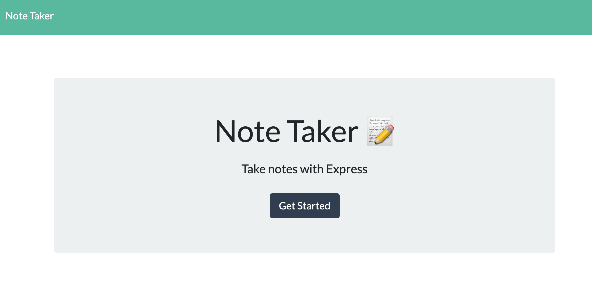

  <h1 align="center">Cloud Note Taker</h1><br/>

  [](https://opensource.org/licenses/MIT) <br/><br/>

  ## Description
🔍 A node.js application used to create, store and delete notes.<br/><br/>

<br/>
Deployed live on [heroku](https://salty-anchorage-58170.herokuapp.com/)<br/>

  ## Table of Contents
  - [Description](#description)
  - [Installation](#installation)
  - [User Story](#usage)
  - [License](#license)
  - [Contributors](#contributors)
  - [Testing](#testing)
  - [Questions](#questions)

  ## Installation
  `npm install from the project directory` <br/><br/>

  ## User Story

```
AS A small business owner
I WANT to be able to write and save notes
SO THAT I can organize my thoughts and keep track of tasks I need to complete
```

  ## Software License
  [](https://opensource.org/licenses/MIT) <br/>
  This software is licensed under the "The MIT License" license.
  https://opensource.org/licenses/MIT <br/><br/>

  ## Contributors
  Rich Stanbaugh<br/>
  MSU Bootcamp Staff <br/><br/>

  ## Testing
  ✏️
  `npm install jest --save-dev` <br/>

  ## Questions
  If you  hvae questions, you can:
  - :eyes: Find me on GitHub: [rstanbaugh@gmail.com](https://github.com/rstanbaugh@gmail.com), or<br />
  - :email: Email me: rich_bootcamp@icloud.com<br /><br />

  _This README was generated with :heart: by [README-generator](https://github.com/rstanbaugh/README-Generator) :fire: :fire:_


